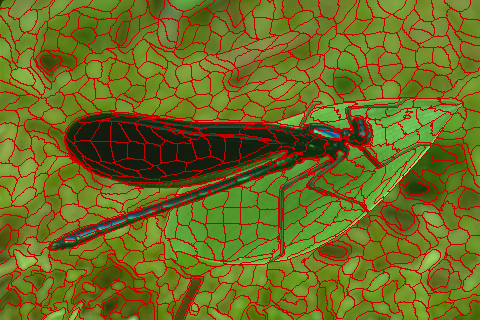

# gGMMSP

This is a real-time implementation of the algorithm GMMSP which is a superpixel segmentation algorithm with high accuracy.

# Requirements

You have to make sure your PC meet the following requirments:
- At least one GPU that supports CUDA (e.g. GTX 1080, GTX 1070, GTX 1060)
- Compute Capabilities >= 3.0
- The lastest GPU driver


# Demo

Just run the demo script.

```matlab
> demo
```

The segmented result is shown below.



# Help

If you want to know how to call the core function of `mx_gGMMSP`, just call it without any arguments.
```matlab
> mx_gGMMSP
```

# Contact

If you have any questions, please create an issue in this repository. 
